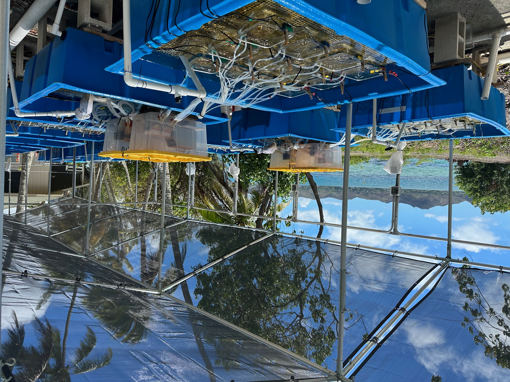

## Project Overview

<center>  
  
{width=80%}
 
</center>

Coral reefs receive subsidies from their adjacent terrestrial environment, and the quality of these subsidies can have substantial impacts on the health and thermal resilience of corals. There is robust experimental evidence that inorganic nutrient enrichment affects coral physiology and reef ecosystem function, and this has been used to explain reef degradation near human populations exposed to nutrient loading. Yet recent findings of enhanced coral resilience on remote, seabird-dominated islands receiving guano-derived nutrient subsidies complicate the assumption that elevated nutrients are uniformly harmful to coral reefs. Additionally, most nutrient enrichment experiments focus on how inorganic nutrient delivery affects corals, separate from the complex chemical mixtures that naturally accompany nutrient subsidies. To understand the direct effects of these complex nutrient subsidies on corals, separate from the broader ecosystem effects present on remote or populated reefs, we performed a manipulative experiment at the Hawai‘i Institute of Marine Biology, dosing corals with seabird guano, wastewater effluent, or inorganic nutrients. We exposed half of the corals to thermal stress and tracked their post-bleaching recovery. Our results demonstrate that a) corals at ambient temperature exposed to nutrient enrichment had elevated photosynthetic performance after 10 weeks of nutrient exposure, b) corals under natural seabird guano nutrient enrichment had enhanced recovery of their photosynthetic performance post-bleaching compared to the other treatments, c) wastewater effluent did not support enhanced recovery post-bleaching, and d) the inorganic nutrient treatment demonstrated the greatest susceptibility to bleaching, indicating that experiments using inorganic nutrients only are not capturing the full effects of complex nutrient sources. Our data provide experimental evidence that resource subsidy quality impacts coral thermal resilience and is contributing to different reef trajectories observed on populated vs remote island ecosystems.

```{r setup chunk, setup, include = FALSE, cache=FALSE}

if (!require('knitr')) install.packages('knitr'); library('knitr')
knitr::opts_chunk$set(
	fig.align = "center",
	message = FALSE,
	warning = FALSE,
	collapse = TRUE
)
# load packages
if (!require("pacman")) install.packages("pacman") # for rapid install if not in library

# use pacman to load all the packages you are missing!
pacman::p_load("knitr", "lme4", "lmerTest", "tidyverse", "car", "emmeans", "seacarb", "magrittr", "gamm4", "mgcv", "tidygam", "tidymv", "gridExtra", "multcomp", "multcompView", "lubridate", "CBASSED50")


### general formatting for figures 
Fig.formatting <- 
  theme(axis.ticks.length = unit(0.2, "cm"),
        axis.text.x = element_text(size = 12, color = "black"),
        axis.text.y = element_text(size = 12, color = "black"),
        axis.title.x = element_text(size = 14, color = "black"),
        axis.title.y = element_text(size = 14, color = "black"),
        legend.text = element_text(size = 10, color = "black"),
        legend.title = element_blank(),
        axis.ticks = element_line(color = "black"),
        legend.key.size = unit(0.6, "cm"))


# Define colors for the treatments
naste_colors <- c("Control" = "#004F7A",  
                      "Effluent" = "#C03922",   
                      "Guano" = "#6DAE90",   
                      "Inorganic" = "#F2C458")  

```

# ENVIRONMENTAL DATA 

## Temperature
```{r, fig.show = 'hide'}
# calibration
#load data
calibration_temp <- read.csv("DATA/NASTE_temp_calibration.csv")
# pivot calibration dataframe longer
calibration_temp <- calibration_temp %>%
  pivot_longer(!Date_Time, names_to = "Tank", values_to = "Temp")
# test for differences between tanks - no difference detected (p=0.105)
aov_temp <-aov(Temp ~ Tank, data=calibration_temp)
summary(aov_temp)
#visualize
calibration_temp %>%
  ggplot( aes(x = Date_Time, y = Temp, group = Tank, color = Tank)) +
  geom_line() +
  ggtitle("TEMP CALIBRATION") +
  ylab("Temp (C)")+
  xlab("7/19/2023")+
  labs(tag = "p=0.105") +
  theme(plot.tag.position = "topright",plot.tag = element_text(size = 10),axis.text.x = element_blank(),legend.position ='bottom')+
  guides(color = guide_legend(nrow = 6,title ="Loggers"))
# To calibrate each temp logger, we did a common garden with a YSI over 2 days in the lab. 
# Take the average of each logger and the YSI over the 2 days, then subtract the loggers from YSI avg.
# Delta is the difference, and will be subtracted from ALL measurements across the experiment for each logger
calibration_temp <- calibration_temp %>%
  group_by(Tank) %>%
  mutate(Average = mean(Temp, na.rm = TRUE))%>%
  ungroup() %>%
  mutate(Delta = Average[which(Tank == "YSI")] - Average)
# calculate the average YSI value for the calibration period to use in acclimation period
calibration_temp %>%
  filter(Tank == "YSI") %>%
  summarise(mean_value = mean(Temp, na.rm = TRUE),
            sd_value   = sd(Temp, na.rm = TRUE))

```

```{r, fig.show = 'hide'}
#load data
Pcom_temp<-read.csv("DATA/NASTE_temp_pcom.csv")
#pivotlonger
Pcom_temp <- Pcom_temp %>%
  pivot_longer(
    cols = -c(Week, Timepoint, Date_Time),  
    names_to = "Tank",     
    values_to = "Temp")    
#join with calibration dataframe    
Pcom_temp <- Pcom_temp %>%
  left_join(
    calibration_temp %>%
      as.data.frame() %>%          
      dplyr::select(Tank, Delta) %>% 
      distinct(),
    by = "Tank")
#correct loggers
Pcom_temp <- Pcom_temp %>%
  mutate(Temp_corrected = Temp + Delta)%>%
  filter(!(Tank %in% c("PCOM.SOURCE")))
# add column for temperature treatment
Pcom_temp <- Pcom_temp %>%
mutate(Temp_trt = case_when(
    Tank %in% c("PA1","PA2","PA3","PA4","PA5","PA6","PA7","PA8","PA9","PA10","PA11","PA12") ~ "Ambient",
    Tank %in% c("PH1","PH2","PH3","PH4","PH5","PH6","PH7","PH8","PH9","PH10","PH11","PH12") ~ "Heated",
    TRUE ~ NA_character_))

# average daily temperature measurements by tank
Pcom_daily <- Pcom_temp %>%
  mutate(Date_Time = mdy_hm(Date_Time),
    Date = as.Date(Date_Time)) %>%
  group_by(Tank, Temp_trt, Date) %>%
  summarise(tank_mean_temp = mean(Temp_corrected, na.rm = TRUE),
    .groups = "drop")

# add sd data
Pcom_daily <- Pcom_daily %>%
  group_by(Temp_trt, Date) %>%
  summarise(
    mean_temp = mean(tank_mean_temp, na.rm = TRUE),
    sd_temp = sd(tank_mean_temp, na.rm = TRUE),
    n_tanks = n(),
    .groups = "drop") %>%
  mutate(
    se_temp = sd_temp / sqrt(n_tanks),
    sd_upper = mean_temp + sd_temp,
    sd_lower = mean_temp - sd_temp,
    Exp_Day = as.numeric(difftime(Date,
                                  as.Date("2023-07-24"),
                                  units = "days")) + 5)

# plot
pcom_temp_plot <- ggplot() +
  geom_line(data = filter(Pcom_daily, Temp_trt == "Ambient"),
            aes(x = Exp_Day, y = mean_temp, color = Temp_trt), linewidth = 1) +
  geom_ribbon(data = filter(Pcom_daily, Temp_trt == "Ambient"),
              aes(x = Exp_Day, ymin = sd_lower, ymax = sd_upper, fill = Temp_trt), alpha = 0.2) +
    geom_line(data = filter(Pcom_daily, Temp_trt == "Heated", Date <= as.Date("2023-09-15")),
            aes(x = Exp_Day, y = mean_temp, color = Temp_trt), linewidth = 1) +
  geom_ribbon(data = filter(Pcom_daily, Temp_trt == "Heated", Date <= as.Date("2023-09-15")),
              aes(x = Exp_Day, ymin = sd_lower, ymax = sd_upper, fill = Temp_trt), alpha = 0.2) +
  labs(x = "Experiment Day",
    y = "Daily Mean Temperature (°C)",
    color = "Treatment",
    fill = "Treatment",
    title = "Porites Daily Average Temperature") +
  theme_classic(base_size = 18) +
  scale_color_manual(values = c("Ambient" = "#004F7A", "Heated" = "#c03922")) +
  scale_fill_manual(values = c("Ambient" = "#004F7A", "Heated" = "#c03922"))+
  theme(panel.border = element_rect(color = "black", fill = NA, linewidth = 0.8), 
        axis.line = element_line(color = "black"),
        axis.text = element_text(size = 18))
pcom_temp_plot
ggsave("PLOTS/pcom_temp_plot.png", width = 9, height = 7, units = "in")


## MONTIPORA
Mcap_temp<-read.csv("DATA/NASTE_temp_mcap.csv")
#pivotlonger
Mcap_temp <- Mcap_temp %>%
  pivot_longer(cols = -c(Week, Timepoint, Date_Time),  
    names_to = "Tank",     
    values_to = "Temp")    
# join with calibration dataframe
Mcap_temp <- Mcap_temp %>%
  left_join(calibration_temp %>%
      as.data.frame() %>%          
      dplyr::select(Tank, Delta) %>% 
      distinct(),
    by = "Tank")
# correct loggers
Mcap_temp <- Mcap_temp %>%
  mutate(Temp_corrected = Temp + Delta)%>%
  filter(!(Tank %in% c("MCAP.SOURCE")))
# add column for temperature treatment
Mcap_temp <- Mcap_temp %>%
  mutate(Temp_trt = case_when(
      Tank %in% c("MA1","MA2","MA3","MA4","MA5","MA6","MA7","MA8","MA9","MA10","MA11","MA12") ~ "Ambient",
      Tank %in% c("MH1","MH2","MH3","MH4","MH5","MH6","MH7","MH8","MH9","MH10","MH11","MH12") ~ "Heated",TRUE ~ NA_character_))

# average daily temperature measurements by tank
Mcap_daily <- Mcap_temp %>%
  mutate(Date_Time = mdy_hm(Date_Time),
    Date = as.Date(Date_Time)) %>%
  group_by(Tank, Temp_trt, Date) %>%
  summarise(tank_mean_temp = mean(Temp_corrected, na.rm = TRUE),
    .groups = "drop")

# add sd data
Mcap_daily <- Mcap_daily %>%
  group_by(Temp_trt, Date) %>%
  summarise(
    mean_temp = mean(tank_mean_temp, na.rm = TRUE),
    sd_temp = sd(tank_mean_temp, na.rm = TRUE),
    n_tanks = n(),
    .groups = "drop") %>%
  mutate(
    se_temp = sd_temp / sqrt(n_tanks),
    sd_upper = mean_temp + sd_temp,
    sd_lower = mean_temp - sd_temp,
    Exp_Day = as.numeric(difftime(Date,
                                  as.Date("2023-07-24"),
                                  units = "days")) + 5)

# Plot 
mcap_temp_plot <-ggplot() +
  geom_line(data = filter(Mcap_daily, Temp_trt == "Ambient"),
            aes(x = Exp_Day, y = mean_temp, color = Temp_trt), linewidth = 1) +
  geom_ribbon(data = filter(Mcap_daily, Temp_trt == "Ambient"),
              aes(x = Exp_Day, ymin = sd_lower, ymax = sd_upper, fill = Temp_trt), alpha = 0.2) +
    geom_line(data = filter(Mcap_daily, Temp_trt == "Heated", Date <= as.Date("2023-09-15")),
            aes(x = Exp_Day, y = mean_temp, color = Temp_trt), linewidth = 1) +
  geom_ribbon(data = filter(Mcap_daily, Temp_trt == "Heated", Date <= as.Date("2023-09-15")),
              aes(x = Exp_Day, ymin = sd_lower, ymax = sd_upper, fill = Temp_trt), alpha = 0.2) +
  labs(x = "Experiment Day",
    y = "Daily Mean Temperature (°C)",
    color = "Treatment",
    fill = "Treatment",
    title = "Montipora Daily Average Temperature") +
  ylim(26, 32)+
  theme_classic(base_size = 18) +
  scale_color_manual(values = c("Ambient" = "#004F7A", "Heated" = "#c03922")) +
  scale_fill_manual(values = c("Ambient" = "#004F7A", "Heated" = "#c03922"))+
  theme(panel.border = element_rect(color = "black", fill = NA, linewidth = 0.8), 
        axis.line = element_line(color = "black"),
        axis.text = element_text(size = 18))

mcap_temp_plot
ggsave("PLOTS/mcap_temp_plot.png", width = 9, height = 7, units = "in")


```

```{r}
# first add species columns
Pcom_daily <- Pcom_daily %>%
  mutate(Species = "Porites")

Mcap_daily <- Mcap_daily %>%
  mutate(Species = "Montipora")

naste_temp <- bind_rows(Pcom_daily, Mcap_daily)

#plot both species
naste_temp_plot <-ggplot() +
  geom_line(data = filter(naste_temp, Temp_trt == "Ambient"),
            aes(x = Exp_Day, y = mean_temp, color = Temp_trt), linewidth = 1) +
  geom_ribbon(data = filter(naste_temp, Temp_trt == "Ambient"),
              aes(x = Exp_Day, ymin = sd_lower, ymax = sd_upper, fill = Temp_trt), alpha = 0.2) +
    geom_line(data = filter(naste_temp, Temp_trt == "Heated", Date <= as.Date("2023-09-15")),
            aes(x = Exp_Day, y = mean_temp, color = Temp_trt), linewidth = 1) +
  geom_ribbon(data = filter(naste_temp, Temp_trt == "Heated", Date <= as.Date("2023-09-15")),
              aes(x = Exp_Day, ymin = sd_lower, ymax = sd_upper, fill = Temp_trt), alpha = 0.2) +
  facet_wrap(~Species, ncol=1)+
  labs(x = "Experiment Day",
    y = "Daily Mean Temperature (°C)",
    color = "Treatment",
    fill = "Treatment",
    title = "NASTE Daily Average Temperature") +
  ylim(26, 32)+
  theme_classic(base_size = 18) +
  scale_color_manual(values = c("Ambient" = "#004F7A", "Heated" = "#c03922")) +
  scale_fill_manual(values = c("Ambient" = "#004F7A", "Heated" = "#c03922"))+
  theme(panel.border = element_rect(color = "black", fill = NA, linewidth = 0.8), 
        axis.line = element_line(color = "black"))

naste_temp_plot

ggsave("PLOTS/naste_temp_plot.png", width = 10, height = 7, units = "in")
```


## Light
```{r, fig.show = 'hide'}
calibration_light <- read.csv("DATA/NASTE_PAR_calibration.csv")
light_mod<-aov(PAR ~ Tank, data = calibration_light)
summary(light_mod) # p = 0.957, no difference between light loggers

#plot calibration test to visually check that loggers are calibrated
calibration_light %>%
  ggplot( aes(x=Timepoint, y=PAR, group=Tank, color=Tank)) +
  geom_line() +
  ggtitle("Light Logger Calibration (PAR)") +
  ylab("Light (PAR)")+
  xlab("7/19 24HR Calibration Period")+
  labs(tag = "p=0.957") +
    theme_classic()+
  theme(legend.position="bottom",plot.tag.position = "topright",plot.tag=element_text(size = 10))+
  guides(color = guide_legend(title="Tank"))+
  scale_color_manual(values = c( "blue","red","darkgreen", "orange"))+
  scale_x_continuous(breaks=c(0,48,96),labels=c('12AM', '12PM', '12AM'))
```
```{r}
#Load data     
PAR <-read.csv("DATA/NASTE_PAR.csv")
PAR$Date <- mdy(PAR$Date)
PAR$Tank <- as.factor(PAR$Tank)
PAR$Species <- as.factor(PAR$Species)

# model p-value is 0.07 - no significant difference between tank blocks
mcap_light_model <- lmer(PAR ~ Tank + (1|Date), data=subset(PAR, Species %in% c("Montipora")))
anova(mcap_light_model)


# model p-value is 0.28 - no significant difference between tank blocks
pcom_light_model <- lmer(PAR ~ Tank + (1|Date), data=subset(PAR, Species %in% c("Porites")))
anova(pcom_light_model)


#remove 9/19 for heated tanks - tanks were condensed on 9/18
PAR <- PAR %>%
  filter(!(Date %in% c("2023-09-19") & Tank %in% c("PCOM HEAT", "MCAP HEAT"))) %>%
#remove 10/10 - experiment ended 10/9
  filter(!(Date %in% c("2023-10-10") & Tank %in% c("PCOM AMB", "MCAP AMB")))

# add column for experiment days
PAR <- PAR %>%
  mutate(Exp_Day = as.numeric(difftime(Date, as.Date("2023-07-24"), units = "days")) + 5)

# create average PAR by day dataframe
PAR_avg <- PAR %>%
  filter(Time >= "06:00" & Time <= "18:00") %>%
  group_by(Date, Tank, Species, Exp_Day) %>%
  summarise(PAR_mean = mean(PAR, na.rm = TRUE),
    PAR_sd = sd(PAR, na.rm = TRUE),
    .groups = "drop")


naste_PAR_plot <- ggplot(PAR_avg, aes(x = Exp_Day, y = PAR_mean, color = Tank, group = Tank)) +
  geom_ribbon(aes(ymin = PAR_mean - PAR_sd, ymax = PAR_mean + PAR_sd, fill = Tank), alpha = 0.2, color = NA) +
  geom_line(linewidth = 1) +
  facet_wrap(~Species, ncol = 1) +
  ylab(expression(paste("PAR (", mu, "mol photons ",  phantom(x), m^{-2}, " ", s^{-1}, ")"))) +
  xlab("Experiment Day") +
  scale_color_manual(values = c("#004F7A", "#C03922", "#004F7A", "#C03922")) +
  scale_fill_manual(values = c("#004F7A", "#C03922", "#004F7A", "#C03922")) +
  theme_classic(base_size=18)+
    theme(panel.border = element_rect(colour = "black", fill = NA, linewidth = 1))
naste_PAR_plot

ggsave("PLOTS/naste_PAR_plot.png", width = 10, height = 7, units = "in")


# calculate average and max PAR and sd to report

PAR_summary <- PAR %>%
  filter(Time >= "06:00" & Time <= "18:00") %>%
  group_by(Date, Species, Exp_Day) %>%
  summarise(daily_PAR = mean(PAR, na.rm = TRUE),
    daily_max_PAR = max(PAR, na.rm = TRUE),
    .groups = "drop") %>%
  group_by(Species) %>%
  summarise(PAR_mean = mean(daily_PAR, na.rm = TRUE),
    PAR_sd = sd(daily_PAR, na.rm = TRUE),
    max_PAR = max(daily_max_PAR, na.rm = TRUE),
    .groups = "drop")

```


## WATER - Nutrients
```{r}
nuts <- read.csv("DATA/water_nuts.csv")
doc <- read.csv("DATA/DOC.csv")

# Nut data wrangling
# add a DIN (dissolved inorganic nitrogen) column by adding N+N and ammonia columns
nuts <- nuts %>%
  mutate(DIN = N.N + Ammonia)
# add a N:P column from TN/TP
nuts <- nuts %>%
  mutate(N_to_P = TN / TP)
# add DON column
nuts <- nuts %>%
  mutate(DON = TN- DIN)
# remove outliers (Porites T2 Inorganic Dosing Nitrate (which removes DIN and DON too) and Montipora T2 aquaria H11 N.N and DIN)
nuts <- nuts %>%
  mutate(
    N.N = ifelse(ID == 56, NA, N.N),
    DIN = ifelse(ID == 56, NA, DIN),
    DON = ifelse(ID == 56, NA, DON),
    N.N = ifelse(ID == 25, NA, N.N),
    DIN = ifelse(ID == 25, NA, DIN))
# remove oultlier from DOC data
doc <- doc %>%
  mutate(NPOC_uM = if_else(SLAB.ID %in% c(46), NA_real_, NPOC_uM))
# join nuts and doc datasets
water<- left_join(nuts, doc, by=c('Aquaria'='Aquaria', 'Timepoint'='Timepoint', 'Treatment'='Treatment'))
# Rename columns
water <- water %>%
  rename(
    Species = Species.x,  
    Tank = Tank.x,  
    Temperature = Temperature.x,
    DOC = NPOC_uM,
    Blue_Tank = Blue_Tank.x)
# select only columns that I want
water <- water %>%
  dplyr::select(-ID, -SLAB.ID, -Tank.y, -Species.y, -Temperature.y, -Blue_Tank.y, -NPOC_mg_L, -TN_mg_L, -TN_uM)
# change to factor
water$Timepoint<-as.factor(water$Timepoint)
water$Species<-as.factor(water$Species)
water$Treatment<-as.factor(water$Treatment)
water$Blue_Tank<-as.factor(water$Blue_Tank)
water$Temperature<-as.factor(water$Temperature)
```

```{r}
## Linear Mixed Effects Models
##############################
### Dosing Containers
TN_model <- water %>%
  filter(Tank == "Dosing") %>%
  lmer(TN ~ Treatment + (1|Timepoint), data= .)
summary(TN_model)
anova(TN_model, type=2)
TN_model_emm <- emmeans(TN_model, pairwise ~ Treatment, adjust = "tukey")
TN_model_emm

TP_model <- water %>%
  filter(Tank == "Dosing") %>%
  lmer(TP ~ Treatment + (1|Timepoint), data= .)
summary(TP_model)
anova(TP_model, type=2)
TP_model_emm <- emmeans(TP_model, pairwise ~ Treatment, adjust = "tukey")
TP_model_emm

PO4_model <- water %>%
  filter(Tank == "Dosing") %>%
  lmer(Phosphate ~ Treatment + (1|Timepoint), data= .)
summary(PO4_model)
anova(PO4_model)
PO4_model_emm <- emmeans(PO4_model, pairwise ~ Treatment, adjust = "tukey")
PO4_model_emm

SiO4_model <- water %>%
  filter(Tank == "Dosing") %>%
  lmer(Silicate ~ Treatment + (1|Timepoint), data= .)
summary(SiO4_model)
anova(SiO4_model)
SiO4_model_emm <- emmeans(SiO4_model, pairwise ~ Treatment, adjust = "tukey")
SiO4_model_emm

DIN_model <- water %>%
  filter(Tank == "Dosing") %>%
  lmer(DIN ~ Treatment + (1|Timepoint), data= .)
summary(DIN_model)
anova(DIN_model)
DIN_model_emm <- emmeans(DIN_model, pairwise ~ Treatment, adjust = "tukey")
DIN_model_emm

N.N_model <- water %>%
  filter(Tank == "Dosing") %>%
  lmer(N.N ~ Treatment + (1|Timepoint), data= .)
summary(N.N_model)
anova(N.N_model)
N.N_model_emm <- emmeans(N.N_model, pairwise ~ Treatment, adjust = "tukey")
N.N_model_emm

NH4_model <- water %>%
  filter(Tank == "Dosing") %>%
  lmer(Ammonia ~ Treatment + (1|Timepoint), data= .)
summary(NH4_model)
anova(NH4_model)
NH4_model_emm <- emmeans(NH4_model, pairwise ~ Treatment, adjust = "tukey")
NH4_model_emm

DOC_model <- water %>%
  filter(Tank == "Dosing") %>%
  lmer(DOC ~ Treatment + (1|Timepoint), data = .)
summary(DOC_model)
anova(DOC_model)
DOC_model_emm <- emmeans(DOC_model, pairwise ~ Treatment, adjust = "tukey")
DOC_model_emm

DON_model <- water %>%
  filter(Tank == "Dosing") %>%
  lmer(DON ~ Treatment + (1|Timepoint), data = .)
summary(DON_model)
anova(DON_model)
DON_model_emm <- emmeans(DON_model, pairwise ~ Treatment, adjust = "tukey")
DON_model_emm

############################
### Aquaria Models
TN_model_t1 <- water %>%
  filter(Tank == "Aquaria" & Timepoint == "T1") %>%
  lmer(TN ~ Treatment + Temperature + (1|Species) , data= .)
summary(TN_model_t1)
anova(TN_model_t1, type = 2)
TN_model_t1_emm <- emmeans(TN_model_t1, pairwise ~ Treatment, adjust = "tukey")
TN_model_t1_emm

TN_model_t2 <- water %>%
  filter(Tank == "Aquaria" & Timepoint == "T2") %>%
  lmer(TN ~ Treatment + Temperature + (1|Species) , data= .)
summary(TN_model_t2)
anova(TN_model_t2, type = 2)
TN_model_t2_emm <- emmeans(TN_model_t2, pairwise ~ Treatment, adjust = "tukey")
TN_model_t2_emm

TP_model_t1 <- water %>%
  filter(Tank == "Aquaria", Timepoint == "T1") %>%
  lmer(TP ~ Treatment + Temperature + (1|Species), data= .)
summary(TP_model_t1)
anova(TP_model_t1)
TP_model_t1_emm <- emmeans(TP_model_t1, pairwise ~ Treatment, adjust = "tukey")
TP_model_t1_emm

TP_model_t2 <- water %>%
  filter(Tank == "Aquaria", Timepoint == "T2") %>%
  lmer(TP ~ Treatment + Temperature + (1|Species), data= .)
summary(TP_model_t2)
anova(TP_model_t2)
TP_model_t2_emm <- emmeans(TP_model_t2, pairwise ~ Treatment, adjust = "tukey")
TP_model_t2_emm

PO4_model_t1 <- water %>%
  filter(Tank == "Aquaria", Timepoint == "T1") %>%
  lmer(Phosphate ~ Treatment + Temperature + (1|Species), data= .)
summary(PO4_model_t1)
anova(PO4_model_t1)
PO4_model_t1_emm <- emmeans(PO4_model_t1, pairwise ~ Treatment, adjust = "tukey")
PO4_model_t1_emm

PO4_model_t2 <- water %>%
  filter(Tank == "Aquaria", Timepoint == "T2") %>%
  lmer(Phosphate ~ Treatment + Temperature + (1|Species), data= .)
summary(PO4_model_t2)
anova(PO4_model_t2)
PO4_model_t2_emm <- emmeans(PO4_model_t2, pairwise ~ Treatment, adjust = "tukey")
PO4_model_t2_emm

SiO4_model_t1 <- water %>%
  filter(Tank == "Aquaria", Timepoint == "T1") %>%
  lmer(Silicate ~ Treatment + Temperature + (1|Species), data= .)
summary(SiO4_model_t1)
anova(SiO4_model_t1)
SiO4_model_t1_emm <- emmeans(SiO4_model_t1, pairwise ~ Temperature, adjust = "tukey")
SiO4_model_t1_emm

SiO4_model_t2 <- water %>%
  filter(Tank == "Aquaria", Timepoint == "T2") %>%
  lmer(Silicate ~ Treatment + Temperature + (1|Species), data= .)
summary(SiO4_model_t2)
anova(SiO4_model_t2)
SiO4_model_t2_emm <- emmeans(SiO4_model_t2, pairwise ~ Temperature, adjust = "tukey")
SiO4_model_t2_emm

N.N_model_t1 <- water %>%
  filter(Tank == "Aquaria", Timepoint == "T1") %>%
  lmer(N.N ~ Treatment + Temperature + (1|Species), data= .)
summary(N.N_model_t1)
anova(N.N_model_t1)
N.N_model_t1_emm <- emmeans(N.N_model_t1, pairwise ~ Treatment, adjust = "tukey")
N.N_model_t1_emm

N.N_model_t2 <- water %>%
  filter(Tank == "Aquaria", Timepoint == "T2") %>%
  lmer(N.N ~ Treatment + Temperature + (1|Species), data= .)
summary(N.N_model_t2)
anova(N.N_model_t2)
N.N_model_t2_emm <- emmeans(N.N_model_t2, pairwise ~ Treatment, adjust = "tukey")
N.N_model_t2_emm

NH4_model_t1 <- water %>%
  filter(Tank == "Aquaria", Timepoint == "T1") %>%
  lmer(Ammonia ~ Treatment + Temperature + (1|Species), data= .)
summary(NH4_model_t1)
anova(NH4_model_t1)
NH4_model_t1_emm <- emmeans(NH4_model_t1, pairwise ~ Treatment, adjust = "tukey")
NH4_model_t1_emm

NH4_model_t2 <- water %>%
  filter(Tank == "Aquaria", Timepoint == "T2") %>%
  lmer(Ammonia ~ Treatment + Temperature + (1|Species), data= .)
summary(NH4_model_t2)
anova(NH4_model_t2)
NH4_model_t2_emm <- emmeans(NH4_model_t2, pairwise ~ Treatment, adjust = "tukey")
NH4_model_t2_emm

DOC_model_t1 <- water %>%
  filter(Tank == "Aquaria", Timepoint == "T1") %>%
  lmer(DOC ~ Treatment + Temperature + (1|Species), data= .)
summary(DOC_model_t1)
anova(DOC_model_t1)
DOC_model_t1_emm <- emmeans(DOC_model_t1, pairwise ~ Treatment, adjust = "tukey")
DOC_model_t1_emm

DOC_model_t2 <- water %>%
  filter(Tank == "Aquaria", Timepoint == "T2") %>%
  lmer(DOC ~ Treatment + Temperature + (1|Species), data= .)
summary(DOC_model_t2)
anova(DOC_model_t2)
DOC_model_t2_emm <- emmeans(DOC_model_t2, pairwise ~ Treatment, adjust = "tukey")
DOC_model_t2_emm

DON_model_t1 <- water %>%
  filter(Tank == "Aquaria", Timepoint == "T1") %>%
  lmer(DON ~ Treatment + Temperature + (1|Species), data= .)
summary(DON_model_t1)
anova(DON_model_t1)
DON_model_t1_emm <- emmeans(DON_model_t1, pairwise ~ Treatment, adjust = "tukey")
DON_model_t1_emm

DON_model_t2 <- water %>%
  filter(Tank == "Aquaria", Timepoint == "T2") %>%
  lmer(DON ~ Treatment + Temperature + (1|Species), data= .)
summary(DON_model_t2)
anova(DON_model_t2)
DON_model_t2_emm <- emmeans(DON_model_t2, pairwise ~ Treatment, adjust = "tukey")
DON_model_t2_emm
```


```{r}
# TN vs TP

TN_vs_TP <- ggplot(water,aes(x = TN, y = TP, color = Treatment, shape = Tank, group = interaction(Treatment, Tank))) +
  geom_point(size = 5) +
  stat_ellipse(aes(fill = Treatment), geom = "polygon", level = 0.5, alpha = 0.25, color = NA) +
  scale_color_manual(values = naste_colors) +
  scale_fill_manual(values = naste_colors) +
  scale_shape_manual(values = c(16, 17)) +
scale_x_log10(breaks = c(1, 2, 3, 4, 5, 6, 7, 8, 9, 10, 20, 30, 40, 50, 60, 70, 80, 90, 100),
  labels = c("1", "2", "3", "4", "5", "6", "7", "8", "9", "10", "20", "30", "40", "50", "60", "70", "80", "90", "100")) +
scale_y_log10(breaks = c(0.1, 0.2, 0.3, 0.5, 0.7, 1, 2, 3, 4, 5, 7, 10),
  labels = c("0.1", "0.2", "0.3", "0.5", "0.7", "1", "2", "3", "4", "5", "7", "10"))+
  labs(x = "TN",
    y = "TP",
    color = "Treatment",
    fill = "Treatment",
    shape = "Tank") +
  theme_classic(base_size = 18) +
  theme(panel.border = element_rect(color = "black", fill = NA, linewidth = 0.8), 
        axis.line = element_line(color = "black"))
TN_vs_TP
ggsave("PLOTS/TN_vs_TP.png")


# NH4 vs N+N

NH4_vs_N.N <-ggplot(water,aes(x = N.N, y = Ammonia, color = Treatment, shape = Tank, group = interaction(Treatment, Tank))) +
  geom_point(size = 5) +
  stat_ellipse(aes(fill = Treatment), geom = "polygon", level = 0.5, alpha = 0.25, color = NA) +
  scale_color_manual(values = naste_colors) +
  scale_fill_manual(values = naste_colors) +
  scale_shape_manual(values = c(16, 17)) +
scale_x_log10(breaks = c(0.1, 0.2, 0.3, 0.5, 0.7, 1, 2, 3, 5, 7, 10),
  labels = c("0.1", "0.2", "0.3", "0.5", "0.7", "1", "2", "3", "5", "7", "10")) +
scale_y_log10(breaks = c(0.1, 0.2, 0.3, 0.5, 0.7, 1, 2, 3, 5, 7, 10, 20, 30, 50, 70),
  labels = c("0.1", "0.2", "0.3", "0.5", "0.7", "1", "2", "3", "5", "7", "10", "20", "30", "50", "70"))+
  labs(x = "N+N",
  y = expression(NH[4] ^"+"),
    color = "Treatment",
    fill = "Treatment",
    shape = "Tank") +
  theme_classic(base_size = 18) +
  theme(panel.border = element_rect(color = "black", fill = NA, linewidth = 0.8))
NH4_vs_N.N

ggsave("PLOTS/NH4_vs_N.N.png")


```
```{r, echo=FALSE}
# Add TIN expected, drawdown, and proportional drawdown columns to the dataframe
nuts_drawdown <- nuts %>%
  left_join(filter(nuts, Tank == "Dosing") %>%
      dplyr::select(Timepoint, Treatment, Species, DIN),  
    by = c("Timepoint", "Treatment", "Species"),  
    suffix = c("", "_dosing")) %>%
  mutate(expected_DIN = ifelse(Tank == "Aquaria", (DIN_dosing * 0.109) + (2.562 * 0.891), NA_real_),
  drawdown_DIN = ifelse(is.na(expected_DIN), NA_real_, expected_DIN - DIN),
   prop_DIN = ifelse(is.na(drawdown_DIN) | is.na(expected_DIN), NA_real_, drawdown_DIN / expected_DIN)) %>%
  dplyr::select(-DIN_dosing)

# Add TP expected, drawdown, and proportional drawdown columns to the dataframe
nuts_drawdown <- nuts_drawdown %>%
  left_join(filter(nuts, Tank == "Dosing") %>%
      dplyr::select(Timepoint, Treatment, Species, TP), 
    by = c("Timepoint", "Treatment", "Species"),  
    suffix = c("", "_dosing")) %>%
  mutate(expected_TP = ifelse( Tank == "Aquaria", (TP_dosing * 0.109) + (0.248 * 0.891), NA_real_),
  drawdown_TP = ifelse(is.na(expected_TP), NA_real_, expected_TP - TP),
   prop_TP = ifelse(is.na(drawdown_TP) | is.na(expected_TP), NA_real_, drawdown_TP / expected_TP)) %>%
  dplyr::select(-TP_dosing)

# Add PO4 expected, drawdown, and proportional drawdown columns to the dataframe
nuts_drawdown <- nuts_drawdown %>%
  left_join(filter(nuts, Tank == "Dosing") %>%
      dplyr::select(Timepoint, Treatment, Species, Phosphate),
    by = c("Timepoint", "Treatment", "Species"), 
    suffix = c("", "_dosing")) %>%
  mutate(expected_PO4 = ifelse(Tank == "Aquaria", (Phosphate_dosing * 0.109) + (0.248 * 0.891), NA_real_),
  drawdown_PO4 = ifelse(is.na(expected_PO4), NA_real_, expected_PO4 - Phosphate),
   prop_PO4 = ifelse(is.na(drawdown_PO4) | is.na(expected_PO4),NA_real_, drawdown_PO4 / expected_PO4)) %>%
  dplyr::select(-Phosphate_dosing)

# remove dosing container rows
nuts_drawdown <- nuts_drawdown %>% drop_na()

# remove 1 oultlier - PO4 in Mcap aquaria H3 at T2 
nuts_drawdown <- nuts_drawdown %>%
  mutate(across(c(expected_TP, drawdown_TP, prop_TP, expected_PO4, drawdown_PO4, prop_PO4), ~ if_else(ID %in% c(42), NA_real_, .)))


# pivot longer
drawdown_long <- nuts_drawdown %>%
  pivot_longer(cols = c(prop_DIN, prop_PO4), 
               names_to = "Nutrient", 
               values_to = "Proportional_Drawdown")
drawdown_long$Nutrient <- factor(drawdown_long$Nutrient, levels = c("prop_DIN", "prop_PO4"))

# plot
prop_drawdown_plot <- ggplot(data = drawdown_long, aes(x = Treatment, y = Proportional_Drawdown, fill = Treatment, alpha = Nutrient)) +
  geom_boxplot(position = position_dodge(width = 0.75)) +
  geom_jitter(aes(group = Nutrient),
            position = position_dodge(width = 0.75),
            shape = 21, color = "black", alpha = 0.6) +
  facet_wrap(~Species, ncol = 1) +
  scale_fill_manual(values = naste_colors) +
scale_alpha_manual(values = c("prop_DIN" = 1, "prop_PO4" = 0.3),
  labels = c("prop_DIN" = "DIN", "prop_PO4" = "PO4"),
  name = "Nutrient")+
  guides(fill = "none")+
  guides(alpha = guide_legend(override.aes = list(fill = "gray50"))) +
  ylab("Percent Drawdown") +
  theme(axis.text.x = element_text(angle = 45, hjust = 1), aspect.ratio = 0.5)+
  ylim(0,1)+
  theme_classic(base_size = 18) +
  theme(panel.border = element_rect(color = "black", fill = NA, linewidth = 0.8))
prop_drawdown_plot

ggsave("PLOTS/prop_drawdown_plot.png")
```


# CORAL DATA


```{r}
## CBASS

# Load CBASS data
cbass <- read.csv("DATA/NASTE_CBASS.csv")

cbass$Temperature <- as.numeric(cbass$Temperature)
cbass$Species <- as.factor(cbass$Species) 
cbass$Genotype <- as.factor(cbass$Genotype)

# Generate ED5, ED50, ED95 data

grouping_properties <- c("Species")
drm_formula <- "PAM_value ~ Temperature"
models <- fit_drms(cbass, grouping_properties, drm_formula, is_curveid = TRUE)

eds <- get_all_eds_by_grouping_property(models)
cbass <- define_grouping_property(cbass, grouping_properties) %>% 
  mutate(GroupingProperty = paste(GroupingProperty, Genotype, sep = "_"))

eds_df <- 
  left_join(eds, cbass, by = "GroupingProperty") %>%
  dplyr::select(names(eds), all_of(grouping_properties)) %>%
  distinct()

eds_df


```


## PAM
```{r}
# Load PAM data
PAM <- read.csv("DATA/NASTE_pam.csv")

# create interaction term
PAM <- PAM %>% 
  mutate(Trt_temp = interaction(Treatment, Temperature, drop=TRUE))

#mgvc package won't read character terms, must convert to factors
PAM$Treatment<-as.factor(PAM$Treatment)
PAM$Temperature<-as.factor(PAM$Temperature)
PAM$Day<-as.numeric(PAM$Day)
PAM$Frag_ID<-as.factor(PAM$Frag_ID)
PAM$Genotype<-as.factor(PAM$Genotype)
PAM$Trt_temp<-as.factor(PAM$Trt_temp)
```

### Porites
```{r}
# Write different model options
  # Model 1 -different slope and different intercept
  # Model 2 - same slope and different intercept
  # Model 3 - global smoother assuming no treatment differences by day

# Note-allowing 'k' to be set automatically by the model, we can adjust to increase or decrease the 'wiggliness'
  
pc_pam_1 <- gam(FvFm~ Trt_temp + s(Day,by=Trt_temp),data=subset(PAM, Species %in% c("Porites"))) #interaction term smoothed by day
summary(pc_pam_1)
anova.gam(pc_pam_1)

pc_pam_2 <- gam(FvFm~ Trt_temp + s(Day), data=subset(PAM, Species %in% c("Porites"))) #interaction term and smoothed day
summary(pc_pam_2)
anova.gam(pc_pam_2)

pc_pam_3 <- gam(FvFm~ s(Day), data=subset(PAM, Species %in% c("Porites"))) #smoothed day
summary(pc_pam_3)
anova.gam(pc_pam_3)

# compare models
pc_AIC <- AIC (pc_pam_1, pc_pam_2, pc_pam_3)
print(pc_AIC) # best option is pc_pam_1 (smallest AIC score) with the interaction term smoothed by day
```

```{r}
#anova just after T2 (day 59 - heat turned off day 55)
# guano higher than control and inorg, effluent similar to all treatments

pc_t2_pam <- aov(FvFm ~ Treatment, data = subset(PAM, Species %in% c("Porites") & Day %in% c("59") & Temperature %in% c("Heated")))
summary(pc_t2_pam)
emmeans(pc_t2_pam, pairwise ~ Treatment, adjust = "tukey")
# Estimated marginal means
emm <- emmeans(pc_t2_pam, "Treatment")
# Tukey post-hoc
pairs <- pairs(emm, adjust = "tukey")
# Compact letter display
cld <- multcomp::cld(emm, Letters = letters, adjust = "tukey")
cld

#t3 - no differences between treatments at T3
pc_t3_pam <- aov(FvFm ~ Treatment, data = subset(PAM, Species %in% c("Porites") & Day %in% c("80") & Temperature %in% c("Heated")))
summary(pc_t3_pam)
emmeans(pc_t3_pam, pairwise ~ Treatment, adjust = "tukey")


```

```{r}
########## PLOT WITH TIDYGAM #############


pc_pam_preds <- predict_gam(pc_pam_1, length_out = 50)
pc_pam_plot <- plot(pc_pam_preds, "Day", "Trt_temp") +
  scale_color_manual(values = c("#004F7A","#C03922","#6DAE90","#F2C458","#004F7A","#C03922","#6DAE90","#F2C458"))+
  scale_fill_manual(values = c("#004F7A","#C03922","#6DAE90","#F2C458", "#004F7A","#C03922","#6DAE90","#F2C458"))+
  ggtitle(expression(paste(italic("Porites compressa")))) +
  ylab(expression(F[v] / F[m])) +  
  xlab("Day") +
  ylim(0.25, 0.6)+
  theme_classic(base_size = 18) +
  theme(panel.border = element_rect(color = "black", fill = NA, linewidth = 0.8))

#to remove points
pc_pam_plot$layers <- pc_pam_plot$layers[!vapply(pc_pam_plot$layers, function(l) inherits(l$geom, "GeomPoint"), logical(1))]
#use this if you want to remove CI bands
pc_pam_plot$layers <- pc_pam_plot$layers[!sapply(pc_pam_plot$layers, function(x) inherits(x$geom, "GeomRibbon"))]
#to increase line width
pc_pam_plot$layers[[1]]$aes_params$linewidth <- 1.25
# to change linetype
pc_pam_plot <- pc_pam_plot+
  aes(linetype=Trt_temp)+
  scale_linetype_manual(
    values = c("solid", "solid", "solid", "solid", "dashed", "dashed", "dashed", "dashed"))

pc_pam_plot

ggsave("PLOTS/pc_pam_plot.png", width = 9, height = 7, units = "in")
```

```{r}
#plot differences

## temperature effect
pc_ca_vs_ch <-get_difference(pc_pam_1, "Day", list(Trt_temp = c("Control.Ambient", "Control.Heated")))
plot(pc_ca_vs_ch)+
  ggtitle("Control Ambient vs Control Heated")+
  ylim(-0.15, 0.175)+
   theme(axis.title.y = element_blank())
ggsave("PLOTS/pc_ca_vs_ch.png")


pc_ea_vs_eh <-get_difference(pc_pam_1, "Day", list(Trt_temp = c("Effluent.Ambient", "Effluent.Heated")))
plot(pc_ea_vs_eh)+
  ggtitle("Effluent Ambient vs Effluent Heated")+
  ylim(-0.15, 0.175)+
   theme(axis.title.y = element_blank())
ggsave("PLOTS/pc_ea_vs_eh.png")


pc_ga_vs_gh <-get_difference(pc_pam_1, "Day", list(Trt_temp = c("Guano.Ambient", "Guano.Heated")))
plot(pc_ga_vs_gh)+
  ggtitle("Guano Ambient vs Guano Heated")+
  ylim(-0.15, 0.175)+
   theme(axis.title.y = element_blank())
ggsave("PLOTS/pc_ga_vs_gh.png")


pc_ia_vs_ih <-get_difference(pc_pam_1, "Day", list(Trt_temp = c("Inorganic.Ambient", "Inorganic.Heated")))
plot(pc_ia_vs_ih)+
  ggtitle("Inorganic Ambient vs Inorganic Heated")+
  ylim(-0.15, 0.175)+
   theme(axis.title.y = element_blank())
ggsave("PLOTS/pc_ia_vs_ih.png")


# ambient differences
pc_ca_vs_ea <-get_difference(pc_pam_1, "Day", list(Trt_temp = c("Control.Ambient", "Effluent.Ambient")))
plot(pc_ca_vs_ea)+
  ggtitle("Control Ambient vs Effluent Ambient")+
  ylim(-0.15, 0.15)+
   theme(axis.title.y = element_blank())
ggsave("PLOTS/pc_ca_vs_ea.png")


pc_ca_vs_ga <-get_difference(pc_pam_1, "Day", list(Trt_temp = c("Control.Ambient", "Guano.Ambient")))
plot(pc_ca_vs_ga)+
  ggtitle("Control Ambient vs Guano Ambient")+
  ylim(-0.15, 0.15)+
   theme(axis.title.y = element_blank())
ggsave("PLOTS/pc_ca_vs_ga.png")


pc_ca_vs_ia <-get_difference(pc_pam_1, "Day", list(Trt_temp = c("Control.Ambient", "Inorganic.Ambient")))
plot(pc_ca_vs_ia)+
  ggtitle("Control Ambient vs Inorganic Ambient")+
  ylim(-0.15, 0.15)+
   theme(axis.title.y = element_blank())
ggsave("PLOTS/pc_ca_vs_ia.png")


pc_ea_vs_ga <-get_difference(pc_pam_1, "Day", list(Trt_temp = c("Effluent.Ambient", "Guano.Ambient")))
plot(pc_ea_vs_ga)+
  ggtitle("Effluent Ambient vs Guano Ambient")+
  ylim(-0.15, 0.2)+
   theme(axis.title.y = element_blank())
ggsave("PLOTS/pc_ea_vs_ga.png")


pc_ea_vs_ia <-get_difference(pc_pam_1, "Day", list(Trt_temp = c("Effluent.Ambient", "Inorganic.Ambient")))
plot(pc_ea_vs_ia)+
  ggtitle("Effluent Ambient vs Inorganic Ambient")+
  ylim(-0.15, 0.175)+
   theme(axis.title.y = element_blank())
ggsave("PLOTS/pc_ea_vs_ia.png")


pc_ga_vs_ia <-get_difference(pc_pam_1, "Day", list(Trt_temp = c("Guano.Ambient", "Inorganic.Ambient")))
plot(pc_ga_vs_ia)+
  ggtitle("Guano Ambient vs Inorganic Ambient")+
  ylim(-0.15, 0.15)+
   theme(axis.title.y = element_blank())
ggsave("PLOTS/pc_ga_vs_ia.png")


# heated differences
pc_ch_vs_eh <-get_difference(pc_pam_1, "Day", list(Trt_temp = c("Control.Heated", "Effluent.Heated")))
plot(pc_ch_vs_eh)+
  ggtitle("Control Heated vs Effluent Heated")+
  ylim(-0.15, 0.15)+
   theme(axis.title.y = element_blank())
ggsave("PLOTS/pc_ch_vs_eh.png")


pc_ch_vs_gh <-get_difference(pc_pam_1, "Day", list(Trt_temp = c("Control.Heated", "Guano.Heated")))
plot(pc_ch_vs_gh)+
  ggtitle("Control Heated vs Guano Heated")+
  ylim(-0.15, 0.15)+
   theme(axis.title.y = element_blank())
ggsave("PLOTS/pc_ch_vs_gh.png")


pc_ch_vs_ih <-get_difference(pc_pam_1, "Day", list(Trt_temp = c("Control.Heated", "Inorganic.Heated")))
plot(pc_ch_vs_ih)+
  ggtitle("Control Heated vs Inorganic Heated")+
  ylim(-0.15, 0.15)+
   theme(axis.title.y = element_blank())
ggsave("PLOTS/pc_ch_vs_ih.png")


pc_eh_vs_gh <-get_difference(pc_pam_1, "Day", list(Trt_temp = c("Effluent.Heated", "Guano.Heated")))
plot(pc_eh_vs_gh)+
  ggtitle("Effluent Heated vs Guano Heated")+
  ylim(-0.15, 0.15)+
   theme(axis.title.y = element_blank())
ggsave("PLOTS/pc_eh_vs_gh.png")


pc_eh_vs_ih <-get_difference(pc_pam_1, "Day", list(Trt_temp = c("Effluent.Heated", "Inorganic.Heated")))
plot(pc_eh_vs_ih)+
  ggtitle("Effluent Heated vs Inorganic Heated")+
  ylim(-0.15, 0.15)+
   theme(axis.title.y = element_blank())
ggsave("PLOTS/pc_eh_vs_gh.png")


pc_gh_vs_ih <-get_difference(pc_pam_1, "Day", list(Trt_temp = c("Guano.Heated", "Inorganic.Heated")))
plot(pc_gh_vs_ih)+
  ggtitle("Guano Heated vs Inorganic Heated")+
  ylim(-0.15, 0.15)+
   theme(axis.title.y = element_blank())
ggsave("PLOTS/pc_gh_vs_ih.png")

```

### Montipora
```{r}
# Write different model options
  # Model 1 -different slope and different intercept
  # Model 2 - same slope and different intercept
  # Model 3 - global smoother assuming no treatment differences by day

# Note-allowing 'k' to be set automatically by the model, we can adjust to increase or decrease the 'wiggliness'
  
mc_pam_1 <- gam(FvFm~ Trt_temp + s(Day,by=Trt_temp),data=subset(PAM, Species %in% c("Montipora"))) #interaction term smoothed by day
summary(mc_pam_1)
anova.gam(mc_pam_1)

mc_pam_2 <- gam(FvFm~ Trt_temp + s(Day), data=subset(PAM, Species %in% c("Montipora"))) #interaction term and smoothed day
summary(mc_pam_2)
anova.gam(mc_pam_2)

mc_pam_3 <- gam(FvFm~ s(Day), data=subset(PAM, Species %in% c("Montipora"))) #smoothed day
summary(mc_pam_3)
anova.gam(mc_pam_3)

# compare models
mc_AIC <- AIC (mc_pam_1, mc_pam_2, mc_pam_3)
print(mc_AIC) # best option is mc_pam_1 (smallest AIC score) with the interaction term smoothed by day
```

```{r}
# anova at T2
mc_t2_pam <- aov(FvFm ~ Treatment, data = subset(PAM, Species %in% c("Montipora") & Day %in% c("80") & Temperature %in% c("Heated")))
summary(mc_t2_pam)
emmeans(mc_t2_pam, pairwise ~ Treatment, adjust = "tukey")
# Estimated marginal means
emm <- emmeans(pc_t2_pam, "Treatment")
# Tukey post-hoc
pairs <- pairs(emm, adjust = "tukey")
# Compact letter display
cld <- multcomp::cld(emm, Letters = letters, adjust = "tukey")
cld

```

```{r}
########## PLOT USING TIDYGAM #############


mc_pam_preds <- predict_gam(mc_pam_1, length_out = 50)
mc_pam_plot <- plot(mc_pam_preds, "Day", "Trt_temp") +
  scale_color_manual(values = c("#004F7A","#C03922","#6DAE90","#F2C458","#004F7A","#C03922","#6DAE90","#F2C458"))+
  scale_fill_manual(values = c("#004F7A","#C03922","#6DAE90","#F2C458", "#004F7A","#C03922","#6DAE90","#F2C458"))+
  ggtitle(expression(paste(italic("Montipora capitata")))) +
  ylab(expression(F[v] / F[m])) +  
  xlab("Day") +
  ylim(0.25, 0.6)+
  theme_classic(base_size = 18) +
  theme(panel.border = element_rect(color = "black", fill = NA, linewidth = 0.8))

#to remove points
mc_pam_plot$layers <- mc_pam_plot$layers[!vapply(mc_pam_plot$layers, function(l) inherits(l$geom, "GeomPoint"), logical(1))]
#use this if you want to remove CI bands
mc_pam_plot$layers <- mc_pam_plot$layers[!sapply(mc_pam_plot$layers, function(x) inherits(x$geom, "GeomRibbon"))]
#to increase line width
mc_pam_plot$layers[[1]]$aes_params$linewidth <- 1.25
# to change linetype
mc_pam_plot <- mc_pam_plot+
  aes(linetype=Trt_temp)+
  scale_linetype_manual(
    values = c("solid", "solid", "solid", "solid", "dashed", "dashed", "dashed", "dashed"))

mc_pam_plot

ggsave("PLOTS/mc_pam_plot.png", width = 9, height = 7, units = "in")
```

```{r}
#plot differences

## temperature effect
mc_ca_vs_ch <-get_difference(mc_pam_1, "Day", list(Trt_temp = c("Control.Ambient", "Control.Heated")))
plot(mc_ca_vs_ch)+
  ggtitle("Control Ambient vs Control Heated")+
  ylim(-0.15, 0.15)+
   theme(axis.title.y = element_blank())
ggsave("PLOTS/mc_ca_vs_ch.png")


mc_ea_vs_eh <-get_difference(mc_pam_1, "Day", list(Trt_temp = c("Effluent.Ambient", "Effluent.Heated")))
plot(mc_ea_vs_eh)+
  ggtitle("Effluent Ambient vs Effluent Heated")+
  ylim(-0.15, 0.15)+
   theme(axis.title.y = element_blank())
ggsave("PLOTS/mc_ea_vs_eh.png")


mc_ga_vs_gh <-get_difference(mc_pam_1, "Day", list(Trt_temp = c("Guano.Ambient", "Guano.Heated")))
plot(mc_ga_vs_gh)+
  ggtitle("Guano Ambient vs Guano Heated")+
  ylim(-0.15, 0.15)+
   theme(axis.title.y = element_blank())
ggsave("PLOTS/mc_ga_vs_gh.png")


mc_ia_vs_ih <-get_difference(mc_pam_1, "Day", list(Trt_temp = c("Inorganic.Ambient", "Inorganic.Heated")))
plot(mc_ia_vs_ih)+
  ggtitle("Inorganic Ambient vs Inorganic Heated")+
  ylim(-0.15, 0.15)+
   theme(axis.title.y = element_blank())
ggsave("PLOTS/mc_ia_vs_ih.png")


# ambient differences
mc_ca_vs_ea <-get_difference(mc_pam_1, "Day", list(Trt_temp = c("Control.Ambient", "Effluent.Ambient")))
plot(mc_ca_vs_ea)+
  ggtitle("Control Ambient vs Effluent Ambient")+
  ylim(-0.15, 0.15)+
   theme(axis.title.y = element_blank())
ggsave("PLOTS/mc_ca_vs_ea.png")


mc_ca_vs_ga <-get_difference(mc_pam_1, "Day", list(Trt_temp = c("Control.Ambient", "Guano.Ambient")))
plot(mc_ca_vs_ga)+
  ggtitle("Control Ambient vs Guano Ambient")+
  ylim(-0.15, 0.15)+
   theme(axis.title.y = element_blank())
ggsave("PLOTS/mc_ca_vs_ga.png")


mc_ca_vs_ia <-get_difference(mc_pam_1, "Day", list(Trt_temp = c("Control.Ambient", "Inorganic.Ambient")))
plot(mc_ca_vs_ia)+
  ggtitle("Control Ambient vs Inorganic Ambient")+
  ylim(-0.15, 0.15)+
   theme(axis.title.y = element_blank())
ggsave("PLOTS/mc_ca_vs_ia.png")


mc_ea_vs_ga <-get_difference(mc_pam_1, "Day", list(Trt_temp = c("Effluent.Ambient", "Guano.Ambient")))
plot(mc_ea_vs_ga)+
  ggtitle("Effluent Ambient vs Guano Ambient")+
  ylim(-0.15, 0.15)+
   theme(axis.title.y = element_blank())
ggsave("PLOTS/mc_ea_vs_ga.png")


mc_ea_vs_ia <-get_difference(mc_pam_1, "Day", list(Trt_temp = c("Effluent.Ambient", "Inorganic.Ambient")))
plot(mc_ea_vs_ia)+
  ggtitle("Effluent Ambient vs Inorganic Ambient")+
  ylim(-0.15, 0.15)+
   theme(axis.title.y = element_blank())
ggsave("PLOTS/mc_ea_vs_ia.png")


mc_ga_vs_ia <-get_difference(mc_pam_1, "Day", list(Trt_temp = c("Guano.Ambient", "Inorganic.Ambient")))
plot(mc_ga_vs_ia)+
  ggtitle("Guano Ambient vs Inorganic Ambient")+
  ylim(-0.15, 0.15)+
   theme(axis.title.y = element_blank())
ggsave("PLOTS/mc_ga_vs_ia.png")


# heated differences
mc_ch_vs_eh <-get_difference(mc_pam_1, "Day", list(Trt_temp = c("Control.Heated", "Effluent.Heated")))
plot(mc_ch_vs_eh)+
  ggtitle("Control Heated vs Effluent Heated")+
  ylim(-0.15, 0.15)+
   theme(axis.title.y = element_blank())
ggsave("PLOTS/mc_ch_vs_eh.png")


mc_ch_vs_gh <-get_difference(mc_pam_1, "Day", list(Trt_temp = c("Control.Heated", "Guano.Heated")))
plot(mc_ch_vs_gh)+
  ggtitle("Control Heated vs Guano Heated")+
  ylim(-0.15, 0.15)+
   theme(axis.title.y = element_blank())
ggsave("PLOTS/mc_ch_vs_gh.png")


mc_ch_vs_ih <-get_difference(mc_pam_1, "Day", list(Trt_temp = c("Control.Heated", "Inorganic.Heated")))
plot(mc_ch_vs_ih)+
  ggtitle("Control Heated vs Inorganic Heated")+
  ylim(-0.15, 0.15)+
   theme(axis.title.y = element_blank())
ggsave("PLOTS/mc_ch_vs_ih.png")


mc_eh_vs_gh <-get_difference(mc_pam_1, "Day", list(Trt_temp = c("Effluent.Heated", "Guano.Heated")))
plot(mc_eh_vs_gh)+
  ggtitle("Effluent Heated vs Guano Heated")+
  ylim(-0.15, 0.15)+
   theme(axis.title.y = element_blank())
ggsave("PLOTS/mc_eh_vs_gh.png")


mc_eh_vs_ih <-get_difference(mc_pam_1, "Day", list(Trt_temp = c("Effluent.Heated", "Inorganic.Heated")))
plot(mc_eh_vs_ih)+
  ggtitle("Effluent Heated vs Inorganic Heated")+
  ylim(-0.15, 0.15)+
   theme(axis.title.y = element_blank())
ggsave("PLOTS/mc_eh_vs_ih.png")


mc_gh_vs_ih <-get_difference(mc_pam_1, "Day", list(Trt_temp = c("Guano.Heated", "Inorganic.Heated")))
plot(mc_gh_vs_ih)+
  ggtitle("Guano Heated vs Inorganic Heated")+
  ylim(-0.15, 0.15)+
   theme(axis.title.y = element_blank())
ggsave("PLOTS/mc_gh_vs_ih.png")


```


```{r}
#### Surface Area and AFDW for normalizations

#load surface area dataset
sa <- read.csv("DATA/NASTE_surfacearea.csv")

#drop 4 negative SA datapoints
sa <- sa %>%
    filter(!(Frag_ID %in% c("P-4-16", "P-4-20", "P-9-1", "P-9-20") & Timepoint == "T3"))

#load AFDW dataset
afdw <- read.csv("DATA/naste_AFDW.csv")

# drop 2 negative AFDW datapoints
afdw <- afdw %>%
  filter(!(Frag_ID %in% c("P-2-7", "M-5-27")))

```

## Symbiont Density
```{r}
symb <- read.csv("DATA/NASTE_symb_density_counts.csv")
symb<- na.omit(symb)

#add SA and AFDW columns
symb <- symb %>%
  dplyr::left_join(sa %>% dplyr::select(Frag_ID, Surface_area.cm2), by = "Frag_ID") %>%
    dplyr::left_join(afdw %>% dplyr::select(Frag_ID, AFDW_gdw), by = "Frag_ID")

symb$Species<-as.factor(symb$Species)
symb$Genotype<-as.factor(symb$Genotype)
symb$Timepoint<-as.factor(symb$Timepoint)
symb$Treatment<-as.factor(symb$Treatment)
symb$Temperature<-as.factor(symb$Temperature)
symb$Trt_temp<-as.factor(symb$Trt_temp)
symb$Cells.ml<-as.numeric(symb$Cells.ml)
symb$Total.cells<-as.numeric(symb$Total.cells)


#calculate symbiont density as cells/cm2, cells/gdw, and create a log10 column 
symb <- symb %>%
  mutate(Symb_density.cells..cm2 = Total.cells / Surface_area.cm2) %>%
  mutate(Symb_density.cells..gdw = Total.cells /(AFDW_gdw))%>%
  mutate(Log_Symb_density.cells..gdw = (log10(Symb_density.cells..gdw)))

write.csv(symb, "DATA/NASTE_symb_final.csv")

```

```{r}
# BAR PLOT

# create facet
symb <- symb %>%
  mutate(Facet = factor(
    paste(Species, Timepoint),
    levels = c(
      "Montipora T2",
      "Montipora T3",
      "Porites T2",
      "Porites T3")))

# recode facet for plot labels
symb$Facet <- dplyr::recode(symb$Facet,
                            "Montipora T2" = "Montipora - Bleaching Period",
                            "Montipora T3" = "Montipora - Recovery Period",
                            "Porites T2" = "Porites - Bleaching Period",
                            "Porites T3" = "Porites - Recovery Period")

symb_summary <- symb %>%
  filter(Timepoint %in% c("T2", "T3")) %>%
  group_by(Treatment, Temperature, Facet) %>%
  summarise(
    mean = mean(Log_Symb_density.cells..gdw, na.rm = TRUE),
    n = sum(!is.na(Log_Symb_density.cells..gdw)),
    se = sd(Log_Symb_density.cells..gdw, na.rm = TRUE) / sqrt(n),
    .groups = "drop"
  ) %>%
  mutate(
    ymin = mean - se,
    ymax = mean + se,
    
    # Back-transform from log10
    mean_bt = 10^mean,
    ymin_bt = 10^ymin,
    ymax_bt = 10^ymax,
    
    # Express as millions of cells gdw^-1
    mean_plot = mean_bt / 10^6,
    ymin_plot = ymin_bt / 10^6,
    ymax_plot = ymax_bt / 10^6
  )
# define a single position_dodge object so both layers use the exact same dodge
pd <- position_dodge2(width = 0.9, preserve = "single")

# Montipora Plot
vert_symb_bar_mc <- ggplot(data = subset(symb_summary, Facet %in% c("Montipora - Bleaching Period", "Montipora - Recovery Period")),
  aes(x = Temperature, y = mean_plot, fill = Treatment, group = Temperature, alpha = Temperature)) +
  geom_col(aes(alpha = Temperature), color = "black", position = pd, width = 0.6) +
  geom_errorbar(aes(ymin = ymin_plot, ymax = ymax_plot), color = "black", position = pd, width = 0.6) +
  facet_wrap(~Facet, ncol = 1) +
  scale_fill_manual(values = naste_colors) +
  scale_alpha_manual(values = c("Ambient" = 1, "Heated" = 0.5)) +
  ylab(expression("Symbiont Density (" * 10^6 ~ "cells gdw"^{-1} * ")")) +
  xlab(NULL) +
  theme_classic() +
  theme(legend.position = "none",
     axis.title = element_text(size = 18),
     axis.text = element_text(size = 16),
     strip.text = element_text(size = 20),panel.border = element_rect(colour = "black", fill = NA, linewidth = 1)) +
  scale_y_continuous(expand = expansion(mult = c(0, 0.05)))
vert_symb_bar_mc

# Porites plot
vert_symb_bar_pc <- ggplot(data = subset(symb_summary, Facet %in% c("Porites - Bleaching Period", "Porites - Recovery Period")),
  aes(x = Temperature, y = mean_plot, fill = Treatment, group = Temperature, alpha = Temperature)) +
  geom_col(aes(alpha = Temperature), color = "black", position = pd, width = 0.6) +
  geom_errorbar(aes(ymin = ymin_plot, ymax = ymax_plot), color = "black", position = pd, width = 0.6) +
  facet_wrap(~Facet, ncol = 1) +
  scale_fill_manual(values = naste_colors) +
  scale_alpha_manual(values = c("Ambient" = 1, "Heated" = 0.5)) +
  ylab(expression("Symbiont Density (" * 10^6 ~ "cells gdw"^{-1} * ")")) +
  xlab(NULL) +
  theme_classic() +
  theme(legend.position = "none",
     axis.title = element_text(size = 18),
     axis.text = element_text(size = 16),
     strip.text = element_text(size = 20),panel.border = element_rect(colour = "black", fill = NA, linewidth = 1)) +
  scale_y_continuous(expand = expansion(mult = c(0, 0.05)))
vert_symb_bar_pc


ggsave("PLOTS/vert_symb_bar_mc.png")
ggsave("PLOTS/vert_symb_bar_pc.png")

```


```{r}
# LME's on log10 data, treatment and temp are fixed effects, genotype is random effect
mc_t2_symb_lm <- lmer(Log_Symb_density.cells..gdw ~ Treatment*Temperature + (1|Genotype), data=subset(symb, Species %in% c("Montipora") & Timepoint %in% c("T2")))
summary(mc_t2_symb_lm)
anova(mc_t2_symb_lm, type=3)
mc_t2_symb_posthoc <- emmeans(mc_t2_symb_lm, pairwise ~ Temperature | Treatment)
multcomp::cld(mc_t2_symb_posthoc, Letters = letters) 

mc_t3_symb_lm <- lmer(Log_Symb_density.cells..gdw ~ Treatment*Temperature + (1|Genotype), data=subset(symb, Species %in% c("Montipora") & Timepoint %in% c("T3")))
summary(mc_t3_symb_lm)
anova(mc_t3_symb_lm, type=3) 
mc_t3_symb_posthoc <- emmeans(mc_t3_symb_lm, pairwise ~ Temperature | Treatment)
multcomp::cld(mc_t3_symb_posthoc, Letters = letters) 

pc_t2_symb_lm <- lmer(Log_Symb_density.cells..gdw ~ Treatment*Temperature + (1|Genotype), data=subset(symb, Species %in% c("Porites") & Timepoint %in% c("T2")))
summary(pc_t2_symb_lm)
anova(pc_t2_symb_lm, type=3) 
pc_t2_symb_posthoc <- emmeans(pc_t2_symb_lm, pairwise ~ Treatment | Temperature)
multcomp::cld(pc_t2_symb_posthoc, Letters = letters) 

pc_t3_symb_lm <- lmer(Log_Symb_density.cells..gdw ~ Treatment*Temperature + (1|Genotype), data=subset(symb, Species %in% c("Porites") & Timepoint %in% c("T3")))
summary(pc_t3_symb_lm)
anova(pc_t3_symb_lm, type=3)
pc_t3_symb_posthoc <- emmeans(pc_t3_symb_lm, pairwise ~ Temperature | Treatment)
multcomp::cld(pc_t3_symb_posthoc, Letters = letters) 
```

```{r, fig.show='hide'}
# Check for normality and homoscedasticity in symbiont density data

## Montipora
### T2
mc_res_symb_t2 <- residuals(mc_t2_symb_lm)
mc_fitted_symb_t2 <- fitted(mc_t2_symb_lm)

# qq norm plot
ggplot(data.frame(resid = mc_res_symb_t2), aes(sample = resid)) +
  stat_qq() +
  stat_qq_line() +
  theme_minimal() +
  labs(title = "Q-Q Plot of Residuals Mcap Symb T2")

# residuals vs fitted plot
plot(mc_fitted_symb_t2, mc_res_symb_t2,
     xlab = "Fitted values",
     ylab = "Residuals",
     main = "Mcap T2 Symb Residuals vs Fitted")+
abline(h = 0, col = "red")

### T3
mc_res_symb_t3 <- residuals(mc_t3_symb_lm)
mc_fitted_symb_t3 <- fitted(mc_t3_symb_lm)

# qq norm plot
ggplot(data.frame(resid = mc_res_symb_t3), aes(sample = resid)) +
  stat_qq() +
  stat_qq_line() +
  theme_minimal() +
  labs(title = "Q-Q Plot of Residuals Mcap Symb T3")

# residuals vs fitted plot
plot(mc_fitted_symb_t3, mc_res_symb_t3,
     xlab = "Fitted values",
     ylab = "Residuals",
     main = "Mcap T3 Symb Residuals vs Fitted")+
abline(h = 0, col = "red")

# Montipora T2 and T3 data shows mild non-normality and non-homoscedasticity, however lmer and anova should be able to handle that since my sample size is large. 

## Porites
### T2
pc_res_symb_t2 <- residuals(pc_t2_symb_lm)
pc_fitted_symb_t2 <- fitted(pc_t2_symb_lm)

# qq norm plot
ggplot(data.frame(resid = pc_res_symb_t2), aes(sample = resid)) +
  stat_qq() +
  stat_qq_line() +
  theme_minimal() +
  labs(title = "Q-Q Plot of Residuals Pcom Symb T2")

# residuals vs fitted plot
plot(pc_fitted_symb_t2, pc_res_symb_t2,
     xlab = "Fitted values",
     ylab = "Residuals",
     main = "Pcom T2 Symb Residuals vs Fitted")+
abline(h = 0, col = "red")

### T3
pc_res_symb_t3 <- residuals(pc_t3_symb_lm)
pc_fitted_symb_t3 <- fitted(pc_t3_symb_lm)

# qq norm plot
ggplot(data.frame(resid = pc_res_symb_t3), aes(sample = resid)) +
  stat_qq() +
  stat_qq_line() +
  theme_minimal() +
  labs(title = "Q-Q Plot of Residuals Pcom Symb T3")

# residuals vs fitted plot
plot(pc_fitted_symb_t3, pc_res_symb_t3,
     xlab = "Fitted values",
     ylab = "Residuals",
     main = "Pcom T3 Symb Residuals vs Fitted")+
abline(h = 0, col = "red")

# Porites T2 and T3 data shows mild non-normality and non-homoscedasticity, however lmer and anova should be able to handle that since my sample size is large
```

## Chlorophyll

```{r, fig.show ='hide'}
#load data
chl <- read.csv("DATA/NASTE_chl.csv")

#formatting
chl<-subset(chl, Species!="BLANK")

#join surface area column to chl dataframe
chl <- chl %>%
  dplyr::left_join(sa %>% dplyr::select(Frag_ID, Surface_area.cm2), by = "Frag_ID") %>%
    dplyr::left_join(afdw %>% dplyr::select(Frag_ID, AFDW_gdw), by = "Frag_ID")

# create column for chl/sa (ug/cm2)
chl <- chl %>%
  mutate(Chl_content.ug..cm2 = (Total_Chl_ug.mL*Slurry_Vol.mL) / Surface_area.cm2)%>%
  mutate(Chl_content.ug..gdw = (Total_Chl_ug.mL*Slurry_Vol.mL) / AFDW_gdw)%>%
  mutate(Log_Chl_content.ug..gdw = (log10(Chl_content.ug..gdw)))

chl$Species<-as.factor(chl$Species)
chl$Genotype<-as.factor(chl$Genotype)
chl$Timepoint<-as.factor(chl$Timepoint)
chl$Treatment<-as.factor(chl$Treatment)
chl$Temperature<-as.factor(chl$Temperature)

# Look at Histograms for outliers
ggplot(data = chl %>%
         filter(Species %in% c("Montipora")),
       aes(x=Chl_content.ug..gdw)) +
  geom_histogram()+
  ggtitle("Montipora Chlorophyll Density Histogram")

ggplot(data = chl %>%
         filter(Species %in% c("Porites")),
       aes(x=Chl_content.ug..gdw)) +
  geom_histogram()+
  ggtitle("Porites Chlorophyll Density Histogram")


# Filter frag with 2x higher chl
chl <- chl %>%
  filter(!(Frag_ID %in% c("P-6-15")))

write.csv(symb, "DATA/NASTE_chk_final.csv")

```

```{r}
# BAR PLOT

# create facet
chl <- chl %>%
  mutate(Facet = factor(
    paste(Species, Timepoint),
    levels = c(
      "Montipora T2",
      "Montipora T3",
      "Porites T2",
      "Porites T3")))

# recode facet for plot labels
chl$Facet <- dplyr::recode(chl$Facet,
                            "Montipora T2" = "Montipora - Bleaching Period",
                            "Montipora T3" = "Montipora - Recovery Period",
                            "Porites T2" = "Porites - Bleaching Period",
                            "Porites T3" = "Porites - Recovery Period")

chl_summary <- chl %>%
  filter(Timepoint %in% c("T2", "T3")) %>%
  group_by(Treatment, Temperature, Facet) %>%
  summarise(mean = mean(Log_Chl_content.ug..gdw, na.rm = TRUE),
    n = sum(!is.na(Log_Chl_content.ug..gdw)),
    se = sd(Log_Chl_content.ug..gdw, na.rm = TRUE) / sqrt(n),
    .groups = "drop") %>%
  mutate(ymin = mean - se, ymax = mean + se,
    # Back-transform from log10 for plot
    mean_plot = 10^mean,
    ymin_plot = 10^ymin,
    ymax_plot = 10^ymax)

# define a single position_dodge object so both layers use the exact same dodge
pd <- position_dodge2(width = 0.9, preserve = "single")

# Montipora Plot
vert_chl_bar_mc <- ggplot(data = subset(chl_summary, Facet %in% c("Montipora - Bleaching Period", "Montipora - Recovery Period")),
  aes(x = Temperature, y = mean_plot, fill = Treatment, group = Temperature, alpha = Temperature)) +
  geom_col(aes(alpha = Temperature), color = "black", position = pd, width = 0.6) +
  geom_errorbar(aes(ymin = ymin_plot, ymax = ymax_plot), color = "black", position = pd, width = 0.6) +
  facet_wrap(~Facet, ncol = 1) +
  scale_fill_manual(values = naste_colors) +
  scale_alpha_manual(values = c("Ambient" = 1, "Heated" = 0.5)) +
  ylab(expression("Total Chlorophyll (" * mu * "g gdw"^{-1} * ")")) +
  xlab(NULL) +
  theme_classic() +
  theme(legend.position = "none",
     axis.title = element_text(size = 18),
     axis.text = element_text(size = 16),
     strip.text = element_text(size = 20),panel.border = element_rect(colour = "black", fill = NA, linewidth = 1)) +
  scale_y_continuous(expand = expansion(mult = c(0, 0.05)))
vert_chl_bar_mc

# Porites plot
vert_chl_bar_pc <- ggplot(data = subset(chl_summary, Facet %in% c("Porites - Bleaching Period", "Porites - Recovery Period")),
  aes(x = Temperature, y = mean_plot, fill = Treatment, group = Temperature, alpha = Temperature)) +
  geom_col(aes(alpha = Temperature), color = "black", position = pd, width = 0.6) +
  geom_errorbar(aes(ymin = ymin_plot, ymax = ymax_plot), color = "black", position = pd, width = 0.6) +
  facet_wrap(~Facet, ncol = 1) +
  scale_fill_manual(values = naste_colors) +
  scale_alpha_manual(values = c("Ambient" = 1, "Heated" = 0.5)) +
  ylab(expression("Total Chlorophyll (" * mu * "g gdw"^{-1} * ")")) +
  xlab(NULL) +
   theme_classic() +
  theme(legend.position = "none",
     axis.title = element_text(size = 18),
     axis.text = element_text(size = 16),
     strip.text = element_text(size = 20),panel.border = element_rect(colour = "black", fill = NA, linewidth = 1)) +
  scale_y_continuous(expand = expansion(mult = c(0, 0.05)))
vert_chl_bar_pc


ggsave("PLOTS/vert_chl_bar_mc.png")
ggsave("PLOTS/vert_chl_bar_pc.png")

```


```{r}
# LME's on log10 data, treatment and temp are fixed effects, genotype is random effect

# Montipora
mc_t2_chl_lm <- lmer(Log_Chl_content.ug..gdw ~ Treatment*Temperature + (1|Genotype), data=subset(chl, Species %in% c("Montipora") & Timepoint %in% c("T2")))
summary(mc_t2_chl_lm)
anova(mc_t2_chl_lm, type=3)
mc_t2_chl_posthoc <- emmeans(mc_t2_chl_lm, pairwise ~Treatment | Temperature)
multcomp::cld(mc_t2_chl_posthoc, Letters = letters) 

mc_t3_chl_lm <- lmer(Log_Chl_content.ug..gdw ~ Treatment*Temperature + (1|Genotype), data=subset(chl, Species %in% c("Montipora") & Timepoint %in% c("T3")))
summary(mc_t3_chl_lm)
anova(mc_t3_chl_lm, type=3)
mc_t3_chl_posthoc <- emmeans(mc_t3_chl_lm, pairwise ~ Temperature | Treatment)
multcomp::cld(mc_t3_chl_posthoc, Letters = letters) 

# Porites
pc_t2_chl_lm <- lmer(Log_Chl_content.ug..gdw ~ Treatment*Temperature + (1|Genotype), data=subset(chl, Species %in% c("Porites") & Timepoint %in% c("T2")))
summary(pc_t2_chl_lm)
anova(pc_t2_chl_lm, type=3)
pc_t2_chl_posthoc <- emmeans(pc_t2_chl_lm, pairwise ~ Temperature | Treatment)
multcomp::cld(pc_t2_chl_posthoc, Letters = letters) 

pc_t3_chl_lm <- lmer(Log_Chl_content.ug..gdw ~ Treatment*Temperature + (1|Genotype), data=subset(chl, Species %in% c("Porites") & Timepoint %in% c("T3")))
summary(pc_t3_chl_lm)
anova(pc_t3_chl_lm, type=3)
pc_t3_chl_posthoc <- emmeans(pc_t3_chl_lm, pairwise ~ Temperature | Treatment)
multcomp::cld(pc_t3_chl_posthoc, Letters = letters) 

```

```{r, fig.show ='hide'}
# Check for normality and homoscedasticity in chlorophyll data

## Montipora
### T2
mc_res_chl_t2 <- residuals(mc_t2_chl_lm)
mc_fitted_chl_t2 <- fitted(mc_t2_chl_lm)

# qq norm plot
ggplot(data.frame(resid = mc_res_chl_t2), aes(sample = resid)) +
  stat_qq() +
  stat_qq_line() +
  theme_minimal() +
  labs(title = "Q-Q Plot of Residuals Mcap Chl T2")

# residuals vs fitted plot
plot(mc_fitted_chl_t2, mc_res_chl_t2,
     xlab = "Fitted values",
     ylab = "Residuals",
     main = "Mcap T2 Chl Residuals vs Fitted")+
abline(h = 0, col = "red")

### T3
mc_res_chl_t3 <- residuals(mc_t3_chl_lm)
mc_fitted_chl_t3 <- fitted(mc_t3_chl_lm)

# qq norm plot
ggplot(data.frame(resid = mc_res_chl_t3), aes(sample = resid)) +
  stat_qq() +
  stat_qq_line() +
  theme_minimal() +
  labs(title = "Q-Q Plot of Residuals Mcap Chl T3")

# residuals vs fitted plot
plot(mc_fitted_chl_t3, mc_res_chl_t3,
     xlab = "Fitted values",
     ylab = "Residuals",
     main = "Mcap T3 Chl Residuals vs Fitted")+
abline(h = 0, col = "red")

# Montipora T2 and T3 data shows mild non-normality and non-homoscedasticity, however lmer and anova should be able to handle that since my sample size is large

## Porites
### T2
pc_res_chl_t2 <- residuals(pc_t2_chl_lm)
pc_fitted_chl_t2 <- fitted(pc_t2_chl_lm)

# qq norm plot
ggplot(data.frame(resid = pc_res_chl_t2), aes(sample = resid)) +
  stat_qq() +
  stat_qq_line() +
  theme_minimal() +
  labs(title = "Q-Q Plot of Residuals Pcom Chl T2")

# residuals vs fitted plot
plot(pc_fitted_chl_t2, pc_res_chl_t2,
     xlab = "Fitted values",
     ylab = "Residuals",
     main = "Pcom T2 Chl Residuals vs Fitted")+
abline(h = 0, col = "red")

### T3
pc_res_chl_t3 <- residuals(pc_t3_chl_lm)
pc_fitted_chl_t3 <- fitted(pc_t3_chl_lm)

# qq norm plot
ggplot(data.frame(resid = pc_res_chl_t3), aes(sample = resid)) +
  stat_qq() +
  stat_qq_line() +
  theme_minimal() +
  labs(title = "Q-Q Plot of Residuals Pcom Chl T3")

# residuals vs fitted plot
plot(pc_fitted_chl_t3, pc_res_chl_t3,
     xlab = "Fitted values",
     ylab = "Residuals",
     main = "Pcom T3 Chl Residuals vs Fitted")+
abline(h = 0, col = "red")

# Porites T2 and T3 data shows mild non-normality and non-homoscedasticity, however lmer and anova should be able to handle that since my sample size is large
```


## Buoyant Weight

```{r}
# load dataset 
bw <- read.csv("DATA/NASTE_buoyantweight.csv")

# format
bw <- bw %>% drop_na() %>% # remove rows with NAs
    filter(Timepoint %in% c("T0", "T3")) # select only T0 and T3


## Deal with Scale Drift ##
### Find the difference between the T0 and T3 values, then subtract this difference from the T3 weights

# take the mean wet weight of the plugs at each date

means <- bw %>% 
  group_by(Date, Treatment, Species) %>%
  summarise(mean_weight = mean(Wet_weight.g))
print(means)

# create df with only plugs

plug_means<-means[means$Treatment == "plug",]


# Find the difference from the T0 plug measurement to the other dates

# Ensure the date column is in Date format
plug_means <- plug_means %>%
  mutate(Date = as.Date(Date, format = "%m/%d/%Y"))

# Get the reference mean_weight for 7/20/2023
reference_weight <- plug_means %>%
  filter(Date == as.Date("2023-07-20")) %>%
  pull(mean_weight) %>%
  unique() %>%   
  first()        

# Calculate weight_difference
plug_means <- plug_means %>%
  mutate(weight_difference = mean_weight - reference_weight)

## STANDARDIZE WET WEIGHT ##
# first make sure date column is in date format
bw <- bw %>%
  mutate(Date = as.Date(Date, format = "%m/%d/%Y"))

# normalize wet_weight
bw <- bw %>%
  mutate(Wet_weight.g = case_when(
    Date == as.Date("2023-10-06") & Species == "Montipora" ~ Wet_weight.g - 0.2265000,
    Date == as.Date("2023-10-07") & Species == "Porites" ~ Wet_weight.g - 0.3649,
    Date == as.Date("2023-10-08") & Species == "Porites" ~ Wet_weight.g - 0.3541857,
    TRUE ~ Wet_weight.g  # Keep other values unchanged
  ))


########
######## Calculate Coral Dry Weights from Buoyant Weight (Davies 1989)
########

## dry weight of object = weight in water + ((weight in air * Density of water) / Density of object)

## Density of aragonite = 2.93 g/cm-3 (Jokiel et al. 1978)
## avg sea water density = 1.023 g cm-3


#### Using function rho from seacarb package
## rho(S = 35, T = 25, P = 0)

bw <- bw %>% 
  dplyr::select(Frag_ID:Salinity) %>% 
  mutate(Sw_dens = rho(S = Salinity, T = Temp, P = 0), # calculate density of seawater
         Sw_dens = Sw_dens * 0.001) %>%  # convert from kg cm-3 to g cm-3
  drop_na(Sw_dens) %>%
  mutate(n = 1:nrow(.))

# add skeletal densities
bw <- bw %>% 
  dplyr::select(-n) %>%
  mutate(Skel_dens = 2.93) %>% # add skeletal densities
  mutate(Dry_weight.g = Wet_weight.g / (1 - (Sw_dens/Skel_dens)))

# Drop plug rows
bw <- bw %>%
  filter(Treatment !="plug")

## Next we need to find the delta weight between T0-T3

bw <- arrange(bw, Frag_ID) # re-order so that they each frag is grouped

bw <- bw %>%
  mutate(Delta_weight.g = Dry_weight.g - lag(Dry_weight.g))%>%
  mutate(Delta_weight.g = ifelse(Timepoint == "T0", 0, Delta_weight.g))


#join surface area column to bw dataframe
bw <- left_join(bw, sa %>% dplyr::select(Frag_ID, Surface_area.cm2), by="Frag_ID")

#normalize delta values to surface area
bw_final <- bw %>% 
  mutate(Delta_wt_g..cm2 = Delta_weight.g/Surface_area.cm2)%>%
  mutate(Delta_wt_g..cm2 = format(Delta_wt_g..cm2, scientific = FALSE))

# write csv
write.csv(bw_final,"DATA/NASTE_buoyantweight_final.csv")

# read in (if needed)
bw_final<- read.csv("DATA/NASTE_buoyantweight_final.csv")


bw_final$Frag_ID <- as.factor(bw_final$Frag_ID)
bw_final$Genotype <- as.factor(bw_final$Genotype)
bw_final$Treatment <- as.factor(bw_final$Treatment)
bw_final$Temp_trt <- as.factor(bw_final$Temp_trt)
bw_final$Timepoint <- as.factor(bw_final$Timepoint)
bw_final$Species <- as.factor(bw_final$Species)
bw_final$Delta_wt_g..cm2 <- as.numeric(bw_final$Delta_wt_g..cm2)

```

```{r}
# Barplot
# create facet
bw_final <- bw_final %>%
  mutate(Facet = factor(
    paste(Species, Timepoint),
    levels = c(
      "Montipora T2",
      "Montipora T3",
      "Porites T2",
      "Porites T3")))

bw_final$Facet <- dplyr::recode(bw_final$Facet,
                            "Montipora T2" = "Montipora - Bleaching Period",
                            "Montipora T3" = "Montipora - Recovery Period",
                            "Porites T2" = "Porites - Bleaching Period",
                            "Porites T3" = "Porites - Recovery Period")

bw_summary <- bw_final %>%
  filter(Timepoint %in% c("T3")) %>%
  group_by(Treatment, Temp_trt, Species) %>%
  summarise(mean = mean(Delta_wt_g..cm2, na.rm = TRUE),
    se = sd(Delta_wt_g..cm2, na.rm = TRUE) / sqrt(n()),
    .groups = "drop") %>%
  mutate(ymin = mean - se,ymax = mean + se)

# define a single position_dodge object so both layers use the exact same dodge
pd <- position_dodge2(width = 0.9, preserve = "single")

vert_growth_bar <- ggplot(bw_summary,aes(x = Temp_trt, y = mean, fill = Treatment, group = Temp_trt, alpha = Temp_trt)) +
  geom_col(aes(alpha = Temp_trt),
    color = "black",
    position = pd,
    width = 0.6) +
  geom_errorbar(aes(ymin = ymin, ymax = ymax),
    color = "black",
    position = pd,
    width = 0.6) +
  facet_wrap(~Species, ncol = 1, scales = "free_y") +
  scale_fill_manual(values = naste_colors) +
  scale_alpha_manual(values = c("Ambient" = 1, "Heated" = 0.5), guide = "none") +
  ylab(expression("Growth (g cm"^{-2}*")")) + 
  xlab(NULL) +
  theme_classic() +
  theme(axis.title = element_text(size = 18),
     axis.text = element_text(size = 16),
     strip.text = element_text(size = 20),panel.border = element_rect(colour = "black", fill = NA, linewidth = 1)) +
  scale_y_continuous(expand = expansion(mult = c(0, 0.05)))
vert_growth_bar

ggsave("PLOTS/growth_plot.png")
```
```{r}
# Linear Mixed Effects Models on the change in weight over the experiment
mc_bw_lm <- lmer(Delta_wt_g..cm2 ~ Treatment*Temp_trt + (1|Genotype), data=subset(bw_final, Species %in% c("Montipora")))
summary(mc_bw_lm)
anova(mc_bw_lm, type=3)
mc_bw_posthoc <- emmeans(mc_bw_lm, pairwise ~ Temp_trt)
multcomp::cld(mc_bw_posthoc, Letters = letters) 


pc_bw_lm <- lmer(Delta_wt_g..cm2 ~ Treatment*Temp_trt + (1|Genotype), data=subset(bw_final, Species %in% c("Porites")))
summary(pc_bw_lm)
anova(pc_bw_lm, type=3)
pc_bw_posthoc <- emmeans(pc_bw_lm, pairwise ~ Temp_trt)
multcomp::cld(pc_bw_posthoc, Letters = letters) 


```

```{r, fig.show ='hide'}
#check for normality and homoscedasticity

mc_res <- residuals(mc_bw_lm)
mc_fitted <- fitted(mc_bw_lm)

# qq norm plot
ggplot(data.frame(resid = mc_res), aes(sample = resid)) +
  stat_qq() +
  stat_qq_line() +
  theme_minimal() +
  labs(title = "Q-Q Plot of Residuals")

# residuals vs fitted plot
plot(mc_fitted, mc_res,
     xlab = "Fitted values",
     ylab = "Residuals",
     main = "Residuals vs Fitted")
abline(h = 0, col = "red")

# Montipora data shows mild non-normality and non-homoscedasticity, however lmer and anova should be able to handle that since my sample size is large


pc_res <- residuals(pc_bw_lm)
pc_fitted <- fitted(pc_bw_lm)

# qq norm plot
ggplot(data.frame(resid = pc_res), aes(sample = resid)) +
  stat_qq() +
  stat_qq_line() +
  theme_minimal() +
  labs(title = "Q-Q Plot of Residuals")

# residuals vs fitted plot
plot(pc_fitted, pc_res,
     xlab = "Fitted values",
     ylab = "Residuals",
     main = "Residuals vs Fitted")
abline(h = 0, col = "red")

```

